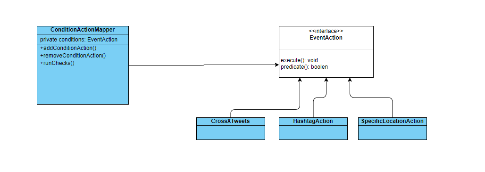

## UML for system

## Cloud deployment
This complete system is deployed to `Azure cloud functions` and are accessible at below URL(this only supports `POST`):

    https://swym-assessment.azurewebsites.net/api/postTweetData?code=5bUlaFQ02PPGMxogLxBQvgO6EAiAHVifulW3wLmZopEgDB9dwCXiLQ==
### Sample Hits
| Sample data      | Response |
| ----------- | ----------- |
| { "username":"rahul", "location":"Pune", "text":"first tweet" }      | rahul made a tweet from city: [Pune] with data: [{"username":"rahul","location":"Pune","text":"first tweet"}] **********       |
| { "username":"Anuj", "location":"Pune", "text":"first tweet", "tweetCount":101 }   | Anuj made a tweet from city: [Pune] with data: [{"username":"Anuj","location":"Pune","text":"first tweet","tweetCount":101}] **********  Anuj crossed 100 tweets.  Adding him to active users list and marking his tweets Green.   Final data : {"username":"Anuj","location":"Pune","text":"first tweet","tweetCount":101,"color":"Green"}   *********        |
| { "username":"vivek", "location":"Pune", "text":"first tweet", "tweetCount":101, "tags": ["awesome-hashtag"] }   | vivek hit this tag: [awesome-hashtag]. Will include him in mails for this tag.  Final data : {"username":"vivek","location":"Pune", "text":"first tweet","tweetCount":101,"tags":["awesome-hashtag"]}   *********  vivek made a tweet from city: [Pune] with data: [ {"username":"vivek","location":"Pune","text":"first tweet","tweetCount":101,"tags":["awesome-hashtag"]}]  **********  vivek crossed 100 tweets. Adding him to active users list and marking his  tweets Green. Final data : {"username":"vivek","location":"Pune", "text":"first tweet","tweetCount":101,"tags":["awesome-hashtag"],"color":"Green"}  *********         |

# Further ideas

We can make this whole system a bit more generic and deployment light by assigning `actions` specific `ids`:
 | Action name| ID |
| ----------- | ----------- |
| SpecificLocationAction| 1       |
| CrossXTweets   | 2        |
| HashTagAction   | 3        |

For each initialization of service, we can pass it one `action - predicate condition` mapping via `DB` or `JSON file`, which will look something like:

    1 Pune
    1 London
    3 100
    3 awesome-tag
Now our main.ts will implement a factory function to initialize all the checks at runtime using this JSON data.
